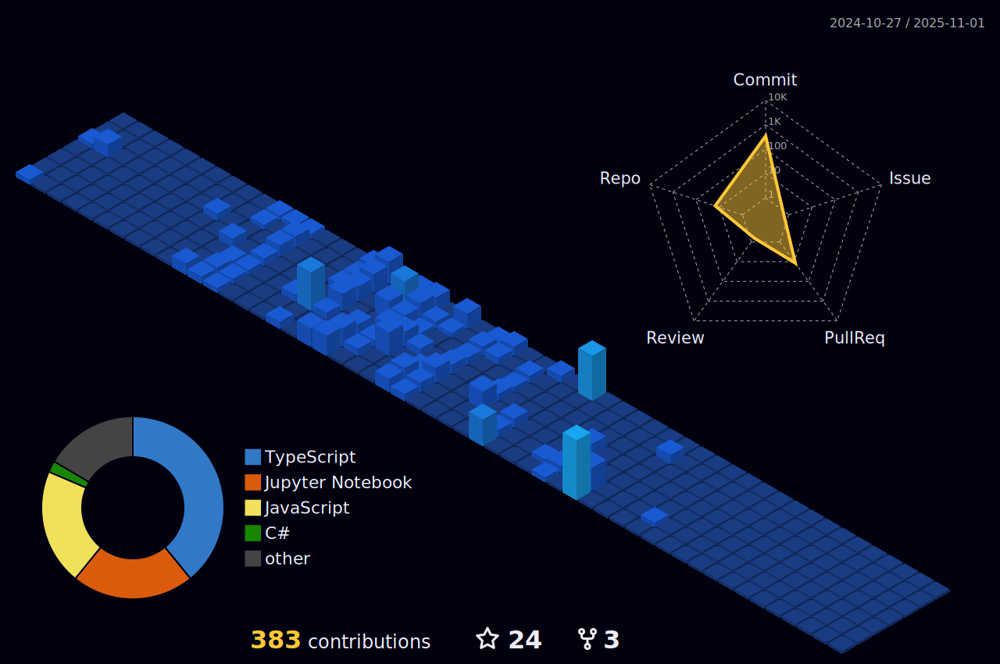

# 🚀 Danish Vahora

  
  
  <h3>Full-Stack Developer & Tech Enthusiast</h3>
  
  

    
    
    
    
  

---

## 💫 About Me

> *"Code is like humor. When you have to explain it, it's bad." – Cory House*

- 🔭 I'm currently working on <!-- Your current project -->
- 👯 I'm looking to collaborate on <!-- Collaboration interests -->
- 🤝 I'm looking for help with <!-- Areas you need help -->
- 🌱 I'm currently learning <!-- What you're learning -->
- 💬 Ask me about <!-- Your expertise -->
- ⚡ Fun fact <!-- An interesting fact about you -->

---

## 🛠️ Professional Summary

I am a versatile developer passionate about building innovative solutions across multiple platforms. With expertise in both frontend and backend technologies, I create robust applications that solve real-world problems.

---

## 🧰 Tech Stack

### Languages

  
  
  
  
  
  
  

### Frontend Frameworks & Libraries

  
  
  

### Backend & Databases

  
  
  
  
  
  
  
  

### DevOps & Cloud

  
  
  
  
  

### Machine Learning & Data Science

  
  
  
  
  
  
  
  

---

## 📈 GitHub Stats

  
   
  
   
  

---

## 🏆 GitHub Trophies

  

---

## 🔝 Top Contributed Repositories

  

---

## 📁 Featured Projects

  <table>
    <tr>
      <td width="50%">
        <h3 align="center">Project 1</h3>
        

          
          

            
            
          

          
<strong>Technologies Used:</strong> React, Python, SpringBoot, Google Collab, Taiwind CSS

          
Intelligent system leveraging AI/ML to automatically identify cryptographic algorithms and enhance cybersecurity.

        

      </td>
      <td width="50%">
        <h3 align="center">Project 2</h3>
        

          
          

            
            
          

          
<strong>Technologies Used:</strong> React, Node.JS, Python, Jupyter Notebook, Taiwind CSS

          
Enterprise plant disease detection system using deep learning and computer vision for agricultural optimization.

        

      </td>
    </tr>
  </table>

---

## 🔄 Ongoing Contributions

  

  

---

## 📫 Contact Me

I'm always open to interesting conversations, collaboration opportunities, and new projects. Feel free to reach out!

- 📧 Email: [danishvhora786@gmail.com](mailto:danishvhora786@gmail.com)
- 💼 LinkedIn: [Danish Vahora](https://www.linkedin.com/in/danish-vahora-8b3b6b262/)
- 🌐 Website: [My Portfolio](https://danishvahora.vercel.app/)

---

<!-- Proudly created with GPRM ( https://gprm.itsvg.in ) -->

---

*Always eager to collaborate, learn, and innovate. Let's build something amazing together!*
